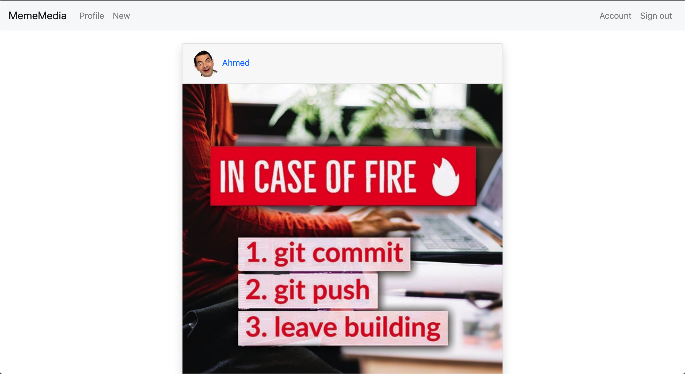
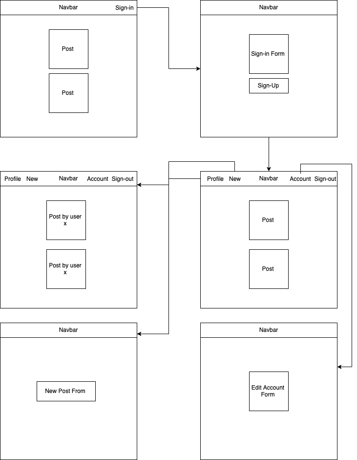
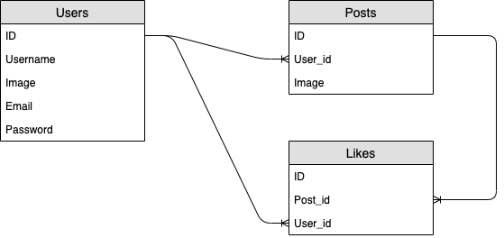

<!-- md -> markdown -->
<!-- Github markdown -->

# MemeMedia
An interactive webpage where users can share and like memes.

## Project Deployment
[Try It Now](https://floating-inlet-54957.herokuapp.com/)

<!-- Tech list -->
## Techonology Stack
* Ruby on Rails
* PostgreSQL
* Bootstrap

## ScreenShot
<!-- Image -->

## Wireframes and User stories.

* The users start in the home index where they can view all the posts
* The users can signin or signup
* The users then can like posts
* The users can visit their own profile
* The users can visit other profiles
* The users can edit their acount inforamtion
* The users can submit new posts
* The users can edit thier posts
* The users can sign out

## Planning and Development Process
#### Day 1
* Created the initial application, models, views, and the controller
* Finished the Create part of CRUD

#### Day 2
* Finished the rest of CRUD
* Finished all of the views
* Started Implement the styling

#### Day 3
* Finalized the Style
* Fixed the like button so that a user can like a post only once

#### Day 4
* Implemented Profiles to allow users to visit their and other's profiles
* Tested all possible scenarios

## Challenges
* Adding extra attributes to the devise generated model
* Dealing with conflicting bootstrab and custom CSS

## Unsolved problems which would be fixed in future iterations.
* Implemeting Follow
* Sorting post based on relevance
* Updating only the like portion after the like action
